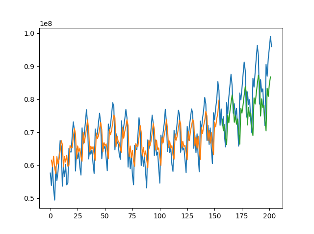
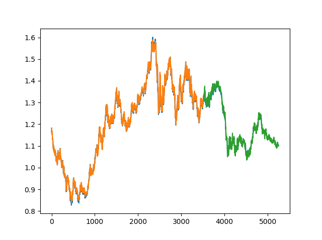

# Time-Series-Forecasting-
LSTM application for time series forecasting

### Data

```
dataframe = pandas.read_csv('flight_data.csv', usecols=[1], engine='python')
```
Dataframe Structure

```
   Total
0	57,633,352
1	53,866,781
2	59,723,147
3	52,758,886
4	49,450,152
...	...
198	86,957,560
199	92,269,298
200	95,532,607
201	99,069,561
202	95,936,298
203 rows × 1 columns
```

Run Following two files to get results

```
python flight_forecast.py

python dexuseu_forecast.py
```

Results




1. Blue graph represents the original data
2. Orange graph represents forecasting on training data
3. Green graph represent the forecasting on testing data
